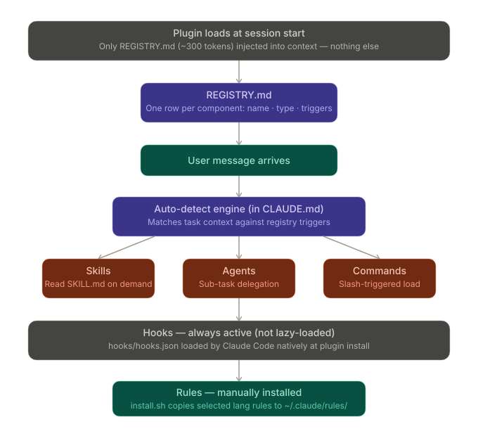

# LABS

**Lazy-loaded Agent/skill Base System for Claude Code.**

LABS is a performance fork of [everything-claude-code](https://github.com/affaan-m/everything-claude-code) that replaces eager component loading with a dual-format registry architecture. Instead of dumping every skill, agent, and command into context at session start, LABS loads only a lightweight registry (~800-1200 tokens) and resolves components on demand.

## Install

```
claude plugin add LuciferDono/LABS
```

## How It Works

At session start, Claude reads only `REGISTRY.md` -- a compact trigger-table covering all 163 components. When a user request matches a trigger, the corresponding skill/agent/command file is loaded just-in-time from the path in `registry.json`.



**Two files, one system:**

- `REGISTRY.md` -- human-readable trigger table, loaded into context at session start
- `registry.json` -- machine-readable manifest with file paths, used by the loader at resolve time

## Components

| Type | Count |
|------|-------|
| Skills | 94 |
| Agents | 18 |
| Commands | 48 |
| Contexts | 3 |
| **Total** | **163** |

## Key Commands

| Command | Purpose |
|---------|---------|
| `/plan` | Plan before implementing |
| `/tdd` | Test-driven development workflow |
| `/verify` | Run all quality gates |
| `/code-review` | Review code before committing |
| `/build-fix` | Fix build and type errors incrementally |
| `/orchestrate` | Delegate complex tasks across agents |
| `/save-session` | Persist session context for later |
| `/resume-session` | Restore a saved session |
| `/refactor-clean` | Remove dead code and duplicates |
| `/loop-start` | Launch an autonomous agent loop |

Run any command by typing it in your Claude Code session. All 48 commands are listed in `REGISTRY.md`.

## Hook Profiles

Hooks are gated by profile. Set via environment variable:

```
export ECC_HOOK_PROFILE=minimal
```

| Profile | Hooks Enabled | Use Case |
|---------|--------------|----------|
| `minimal` (default) | session-start, session-end, cost-tracker, evaluate-session | Low overhead, session lifecycle only |
| `standard` | + quality-gate, formatter, typecheck, console-warn, observe | Balanced quality and safety |
| `strict` | + tmux reminders, git push reminders | Maximum guardrails |

## Session Management

LABS supports cross-session persistence:

- `/save-session` -- serialize current context, decisions, and progress to disk
- `/resume-session` -- reload a previous session and continue where you left off
- `/sessions` -- browse saved sessions

## Plugin Root Resolver

LABS includes a shim that resolves `CLAUDE_PLUGIN_ROOT` reliably across platforms, so hooks and scripts always find their files regardless of install location.

## Credits

Forked from [everything-claude-code](https://github.com/affaan-m/everything-claude-code) by [Affaan Mustafa](https://github.com/affaan-m). Original project provides the skill, agent, and command content that LABS wraps with lazy-loading infrastructure.

## License

MIT
